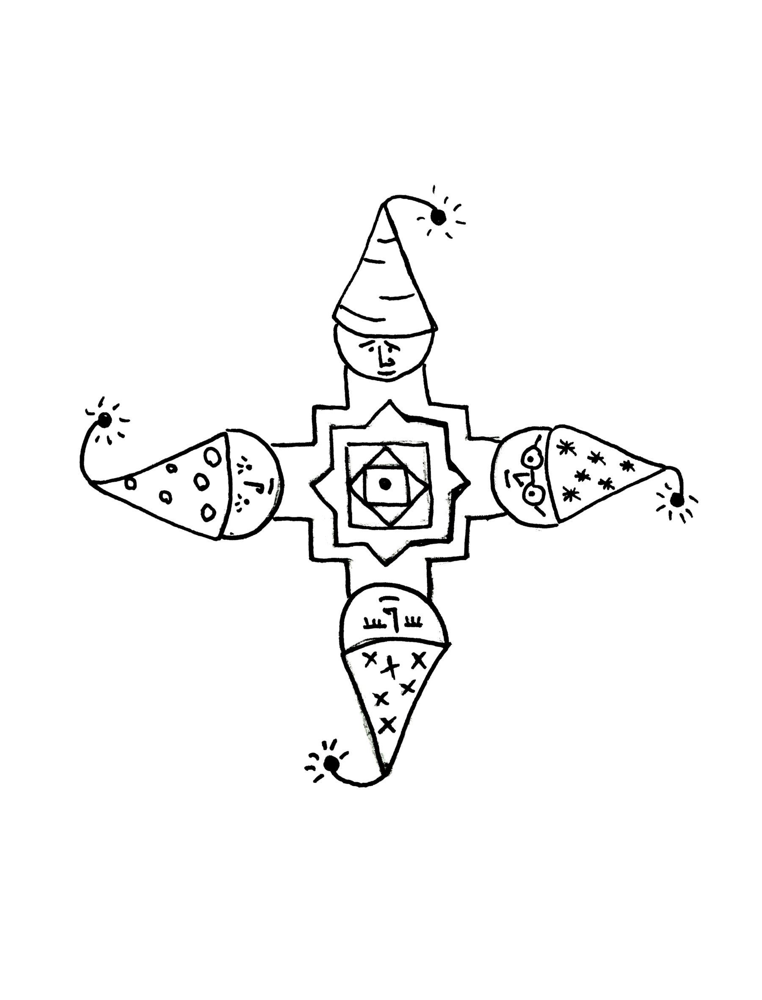

# Attach

What brings you joy?  
Here are a few things from my list (in no particular order):
* Simply being with people I love, doing something together
* Coming up with ideas and making things
* Reading things and understanding them
* Finding things out, solving interesting problems
* Learning new skills
* Walking, running, cycling or swimming, surrounded by nature
* Listening to music and playing music
* Wandering through busy cities

At first sight, the list looks quite random. 

If you dig deeper though, there is a pattern: all these activities are about immersing myself in something, resonating to something, being at one with something. They all involve some interaction. Many involve solitude, but this is always solitude of a very special sort: the solitude of losing myself, the solitude of total immersion.

So I believe true happiness is about being at one with something. When you are an integral part of something - there is a reason for you to exist. A purpose, if you will, even though the word purpose is too loaded. The whole, of which you are a part, needs you to be a part. This whole can be anything you want, large or small. It can be your family, your work of art, your project or Universe at large.

The larger the whole is - the harder it is to truly belong, to see and feel yourself as an integral part of it. Very few enlightened people can truly feel that they are at one with Universe as a whole. The rest of us have to find smaller things to belong to.

So don't be afraid to find something (or somebody) to attach to, to be at one with. It doesn't have to be something or somebody special. Because once you are at one, you two will be special by the very fact of your oneness.

Don't be afraid to need somebody, or to have somebody who needs you. Any oneness is temporary, except oneness with the whole world. But why knowing that should not stop you from being at one and enjoying it while it lasts.

* * *
Read More:
* Buckminster Fuller
