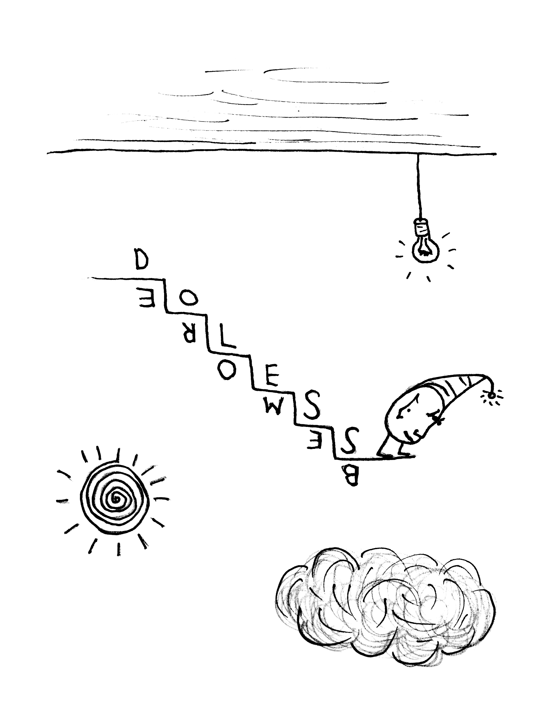

# Be more

There is a big mountain not too far from where I am right now. On top of it there is a pine tree and a little ant is marching on one of its roots. All of them - the mountain, the tree and the ant - are perfectly expressing their nature at this very moment. Nothing more, nothing less.

But if I look in the mirror, what I see there seems to be different. I am only a shadow of the man I want to be, only half of the man the world expects me to become. Most of the time I can sense a gap between who I am and who I ought to be, what I am doing and what I should be doing.

When I'm looking in the mirror - I am standing at the edge of this gap. Looking down into the abyss and in front of me, at the other side, feeling dizzy. This dizziness comes from the sense of possibility: What if I could jump over? What if I fall down? This freedom to try and bridge the gap is powerful and frightening.

This gap has been with me for as long as I can remember. It is, to a certain degree, what I call "me". Wherever it comes from, it creates uneasiness about being myself and also the need for some bridging action.

So I start to define myself through my possibilities, my goals, and more than anything else - through the things I do. If the ever moving horizon of the man I need to become is unreachable, then the best I can do is measure myself through how fast I'm running, through the number of things I do each day. And very soon I need to keep running in order to just stand still.

But what if there is no gap? After all the mountain is perfectly expressing its nature not because it's striving to be a perfect mountain. It simply can't stop being a mountain. That's what it is.

Hold your breath. Or your thoughts. If you try to hold it for too long - all your goals, all the feeling of the gap disappears. Your whole nature refocuses on resuming itself. Eventually you start breathing (and thinking) again. And so just like a mountain, you simply can't help being yourself. That's who you are.

Nature does not have goals. Yet it accomplishes so much.
You come out of this world, just like the mountains, trees and ants do. You are the force of nature.

And so there is no gap. True freedom - the freedom to be who you are - has no false possibilities and so it comes without dizziness.
You just need to learn to be comfortable with it, learn to be comfortable with who you are.

Stay Put. Do Less. Be More.

* * *

Read More:
* Shunryu Suzuki
* Alan Watts
* Søren Kierkegaard
