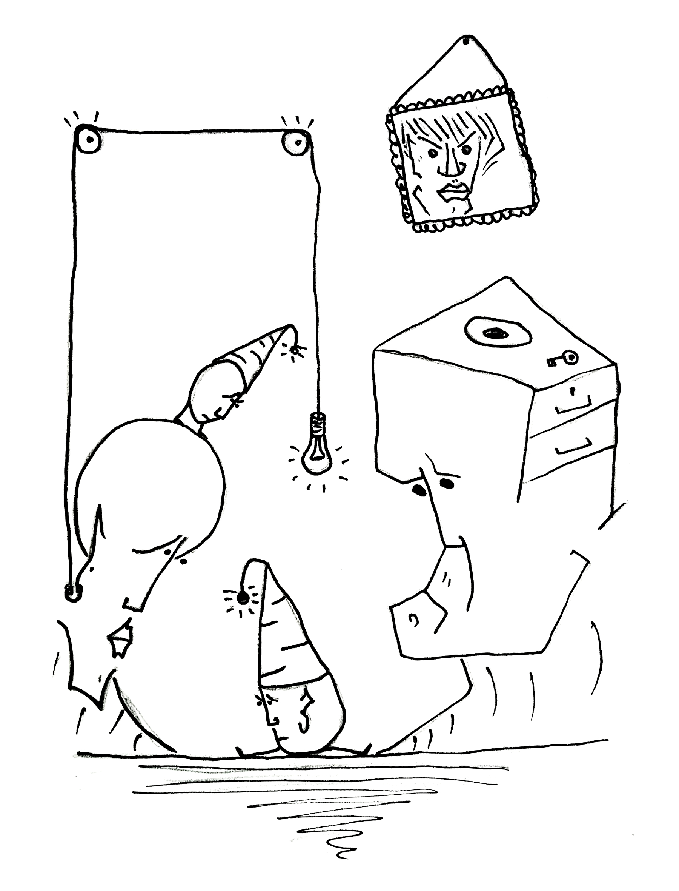

# Care for what matters

At any given moment in time, you can only truly care for just a few things. Start caring for things that do not really matter - and your caring soon runs out and there is none left for the things that _do_ matter. I'm using the word "caring" and not "paying attention" for a reason: we pay attention to things that we care for. Not the other way around.

So if I am running in a park and start caring about what other people think, then there is a good chance that I stop caring about the amazing bodily experience that I am having. Once I stop caring about running, I stop paying attention to the feedback that my body and the path are giving to me. This leads to self-doubt, dissatisfaction and injury.

Yet if you ask me why I'm out in the park running in the first place, then I'll tell you that it's because I enjoy movement or that I want to stay healthy. So, you see, there is a disconnect between what matters to me and what I care for.

The good thing is that if you accept that you can only truly care for very few things at any given moment of time, then you'll have to make a conscious choice about it. You'll have to decide what you are going to care about in everything you do.

You will also have to decide what you are _not_ going to care about. And that is a very powerful thing to do.

* * *
Read More:
* Richard Feynman
