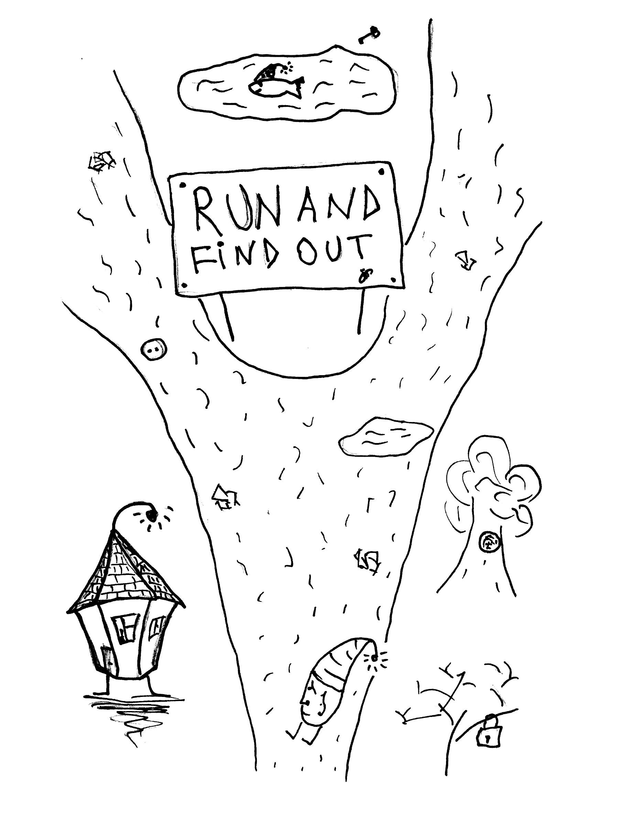

# Run and find out

The world is a diverse, wonderful place. And there are many ways to wonder at it.
One can wonder at the beauty of a flower by looking at it, smelling it, drawing it and taking it a part. One can wonder at how it grows, blooms and fades, at how it can heal bodies and souls, at how it evolved to have an intricate relationship with insects and at how it found new meanings in various cultures.

For a curious mind, there are always new angles, new dimensions, new questions to ask, new things to find out. The circle of your knowledge is ever-expanding, so the more you know, the more there is to know. The more you wonder at the world, the more wonderful things you get to discover. Stay curious and you will never run out of sources of joy.

The pleasure of finding things out is a pleasure of developing a better understanding of how things work, a pleasure of building models and playing with them.

Take a beautiful melody. If your ears are not shut - you can appreciate it. Yet if you manage to understand the underlying pattern of sounds and silence that makes this melody possible - you can have so much more joy. This understanding can be intuitive, mathematical, bodily or anything else. What's important is that it gives you a new dimension of possibilities. Because now you are appreciating not just this melody, but all the other melodies made possible by this pattern. You can play with it, improvise, you can break the pattern and get back to it - and that's a lot of fun.

So every time you are puzzled - be grateful. That's Universe being playful, giving you a chance to have fun. Your best way out of this puzzle is almost always through.

Stay curious. Dig deeper. Run and find out!

* * *

Read More:
* Rudyard Kipling
* Richard Feynman
* Robert Frost
